# Lignum

Warning, a lot of graphics!

It's better to watch with a PC..

[Google Doc (Dev-Notes)](https://docs.google.com/document/d/1Q-RNnGHk--OPBmfrQ1erPlFgvHFczgy6dReDd9U9UyI/)

[Miro (long-term planning)](https://miro.com/welcomeonboard/3eBMrWKlC317iynDRjV8MnUEP9Sj22y7iTPn8p2fNQHeRmXK8JYPcAFLKL7eW1JV)

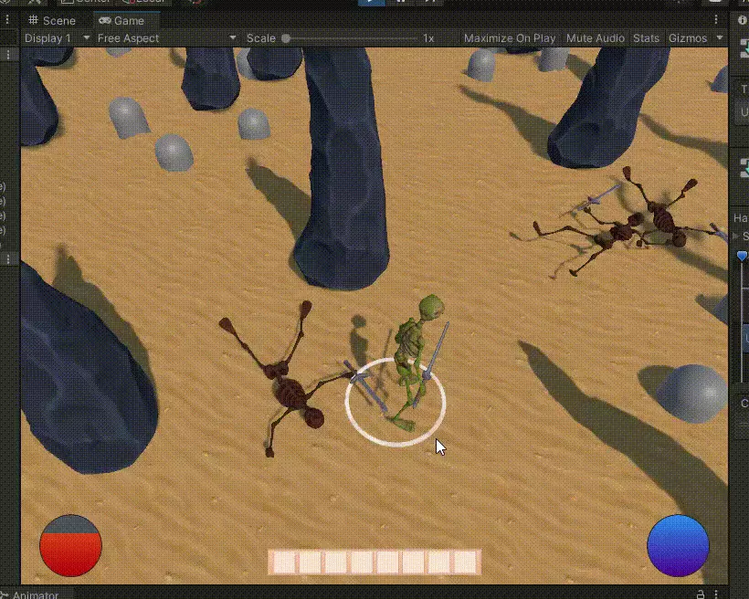

### Contents:

 + [Default control](#Control);
 + [Mobs](#Mobs);
 + [Procedure generate world](#ProcedureWorld)
 + [About biomes](#Biomes)
 + [Player, enemy and skills](#PlayerEnemyAndSkills)

##  Where do we start? With the player:

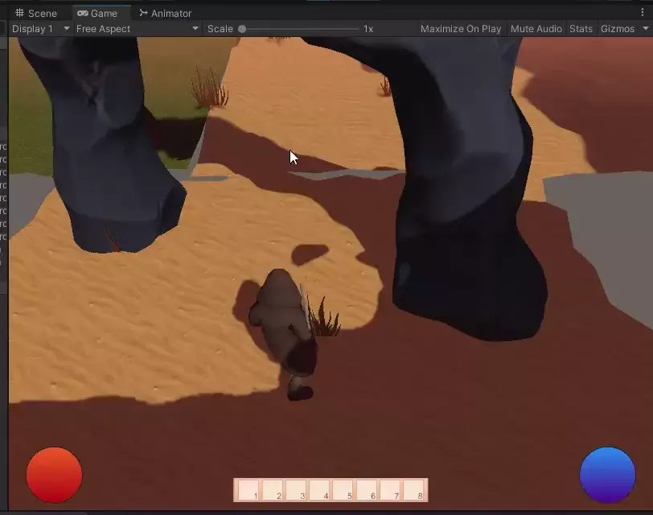

The character is controlled by a mouse click

##  Okay, we have a character, who else is there? Enemies!

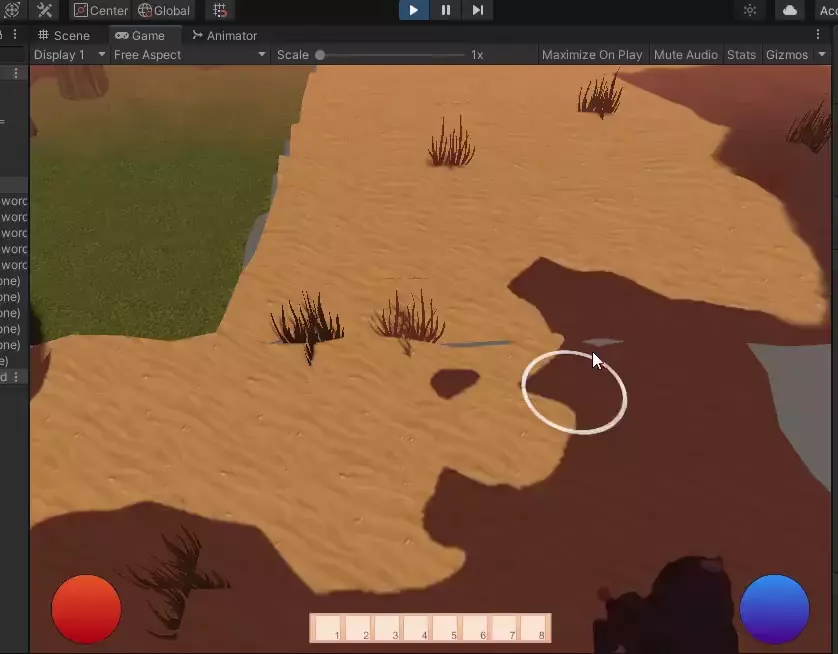

Different enemies in different biomes

What? Biomes?!

##  Yes - we PROCEDURELY GENERATE the base mesh

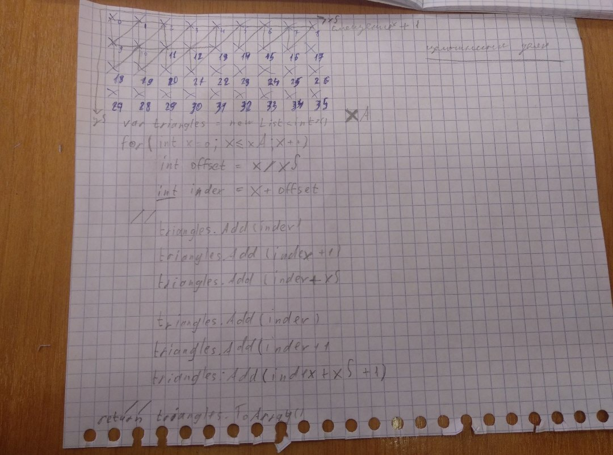

Really? Yup!

That's how it works:

1 - [Create points in space](https://github.com/koplenov/Lignum/blob/2de8e66145bfd05a782d62c9833090dce2af9ea9/Assets/Scripts/Generator.cs#L259-L278)

2 - [Combined into triangles](https://github.com/koplenov/Lignum/blob/2de8e66145bfd05a782d62c9833090dce2af9ea9/Assets/Scripts/Generator.cs#L279-L298)

3 - [Created](https://github.com/koplenov/Lignum/blob/2de8e66145bfd05a782d62c9833090dce2af9ea9/Assets/Scripts/Generator.cs#L299-L309) UV and [applied ](https://github.com/koplenov/Lignum/blob/2de8e66145bfd05a782d62c9833090dce2af9ea9/Assets/Scripts/Generator.cs#L310-L318) the desired scale

4 - [Apply material](https://github.com/koplenov/Lignum/blob/master/Assets/Scripts/Generator.cs#L226)

5 - [Generated objects (scenery, mobs)](https://github.com/koplenov/Lignum/blob/2de8e66145bfd05a782d62c9833090dce2af9ea9/Assets/Scripts/Generator.cs#L168-L193)

6  - ["stage of meshes optimization to save Draw Calls (savings up to 70%!)"](https://github.com/koplenov/Lignum/blob/2de8e66145bfd05a782d62c9833090dce2af9ea9/Assets/Scripts/Generator.cs#L196-L199)

7 - [finishing touches](https://github.com/koplenov/Lignum/blob/2de8e66145bfd05a782d62c9833090dce2af9ea9/Assets/Scripts/Generator.cs#L202-L241)

  
What the first attempts looked like

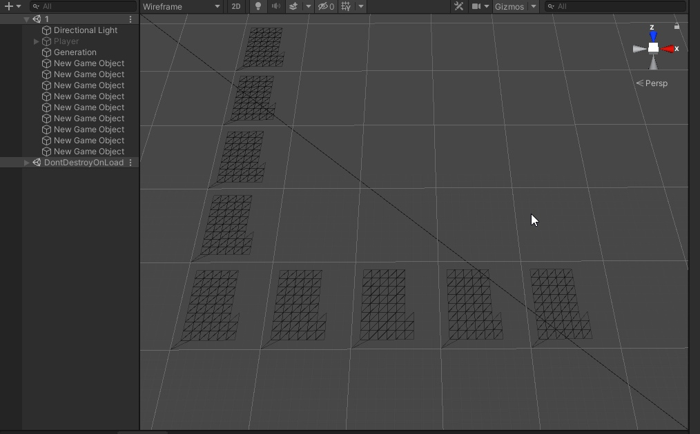
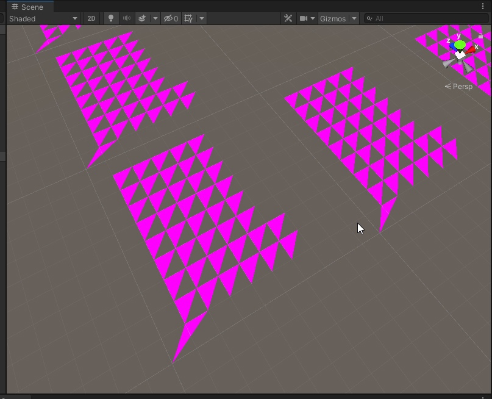
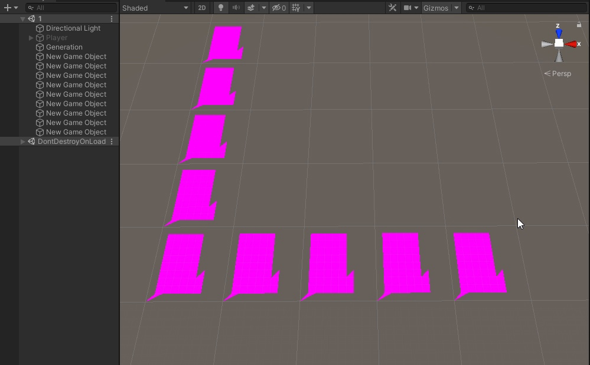
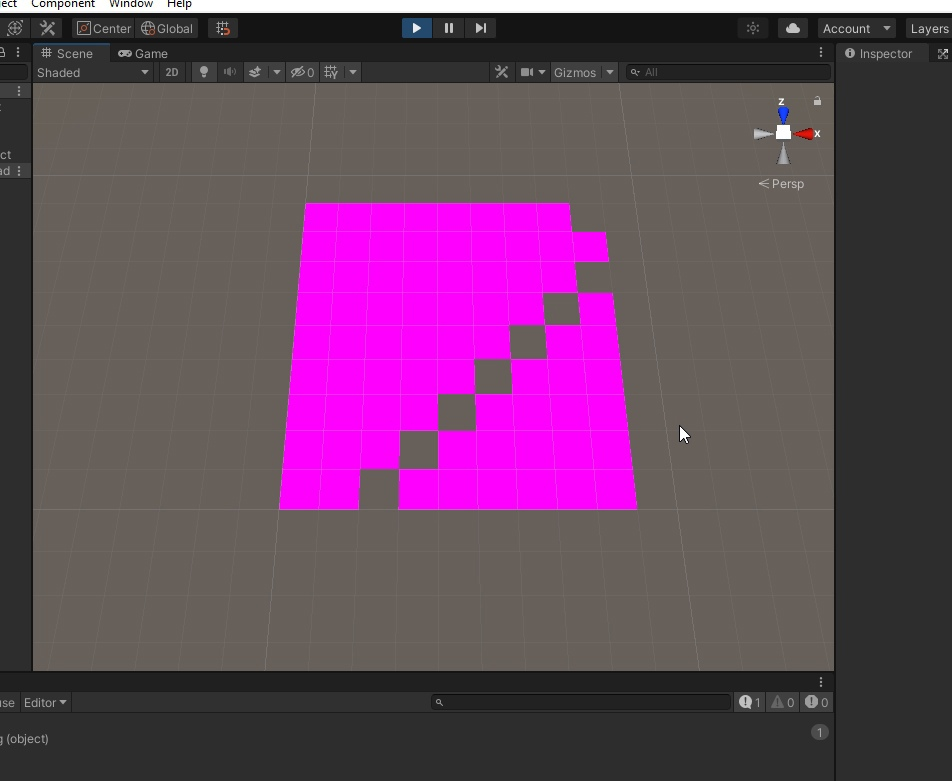
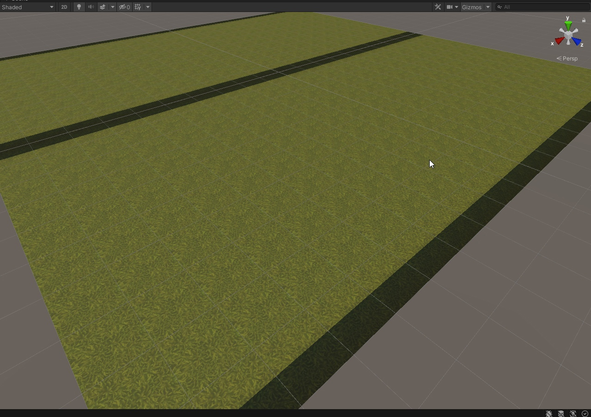
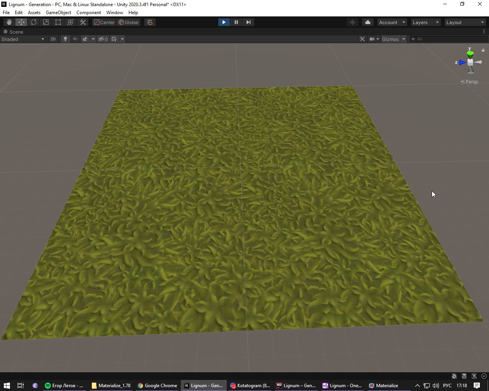
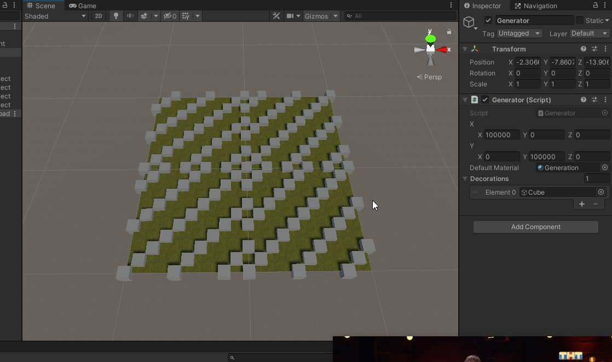
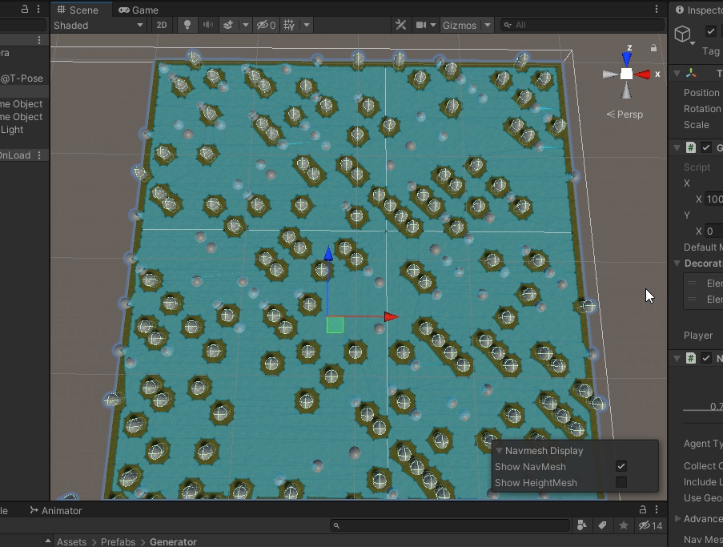

##  So, that's all cool, but what else can we tell you about biomes?

You may notice that the video shows two biomes with different settings

It's true, our implementation allows quite flexible customization and addition of biome settings!

* different sound in different biomes
* different graphic settings (e.g. fog)

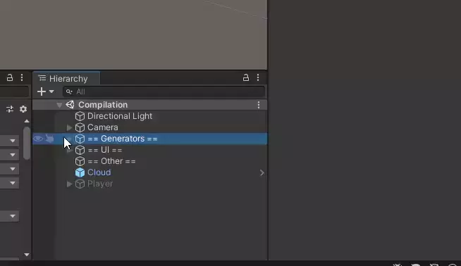

One biome has fog, the other does not.

By the way, did you appreciate the clouds? :D 

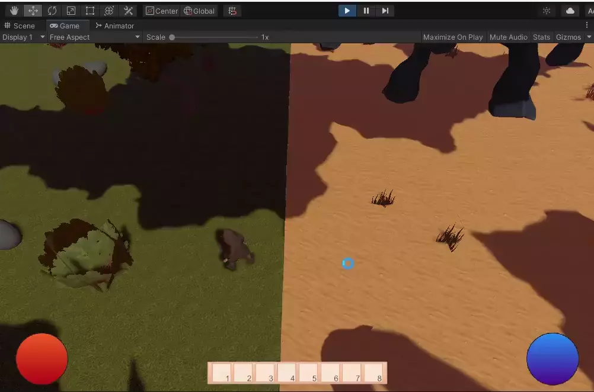

After generating all biomes you [create](https://github.com/koplenov/Lignum/blob/2de8e66145bfd05a782d62c9833090dce2af9ea9/Assets/Scripts/GenerateNavMeshSurface.cs#L30) a navigation grid on which our character and enemies will walk

##  What else can our enemies do, what is their pattern of behavior?

* They patrol the biome from point to point
* If they encounter an enemy, they begin to chase them.
* If they're near the enemy, they start attacking them.
* If the player manages to escape, then... patrol on!

## What can a player do?

He has a sword and can use magic!

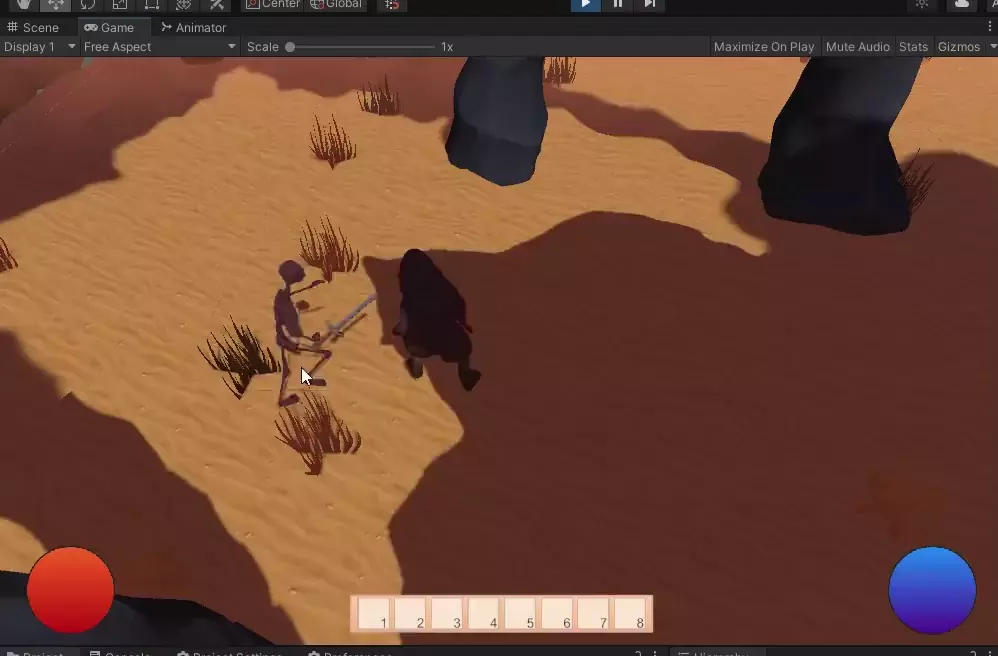

What?! Magic?

Yes, there is a "system" of skills:

* fire circle of two levels

  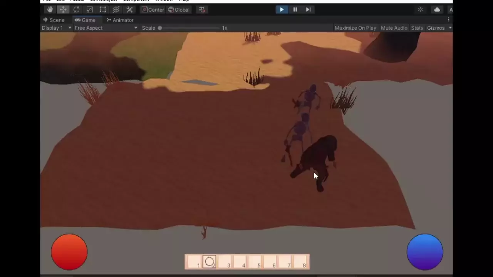

* the ability to replenish health through mana

  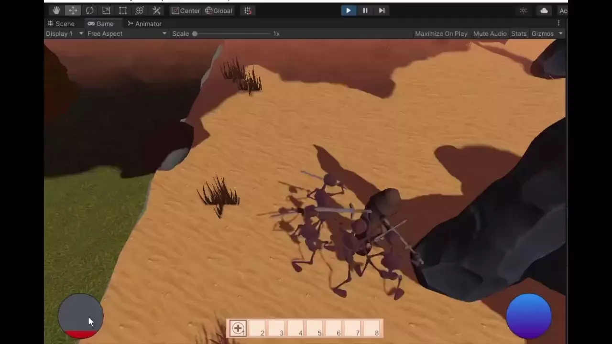

How do you study them?

Here's how the process works:

Find an enemy -> kill him (we get a pump point for that) -> use him!

This brings our *brief* review to an end

### Links that may be helpful:

* https://habr.com/ru/company/badoo/blog/307170/
* https://habr.com/ru/company/badoo/blog/345710/

// hehehe, it was a team effort with [this](https://github.com/jaycob24/) [amazing 3D artist](https://twitter.com/DDDjEKKi) (models are their work) and yes, we didn't make the finals9 